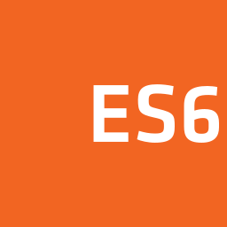

# WELCOME✨🎉

## Hi guys, my name´s Cristofer Angeles 😉. 

I'm from to CDMX 🌮 and have 27 years old.
I'm study  software developer, I like so much this career because I have to solve problems and when I don't understand, I investigate until I find the answer and that gives me a lot of satisfaction.

I consider myself a self-taught person who likes to learn constantly, also someone happy and who likes to enjoy the moment.
I like video games on the Xbox platform, Halo being my favorite game 👾🎮🕹.

I have knowledge in web development in the Frontend part, using **HTML**, **CSS** and **JS**. I also have knowledge in frameworks and libraries such as React JS and Node JS.
The video game development part with the **Unity** graphics engine and using the **C#** language catches my attention, since I have done two 2D video game practices.
And finally I can say that I speak English at an intermediate level (B1).

You can know more about me on my social networks:

## Technologies which I use:

### Frontend Technologies

  
  
  
  
  

 

### Backend Technologies

  
  

### My upcoming challenges

  - Create new websites with  React
  - Learn Python, mongodb, express and more.
  - Learn English language
  
### Tools

  
  
  

